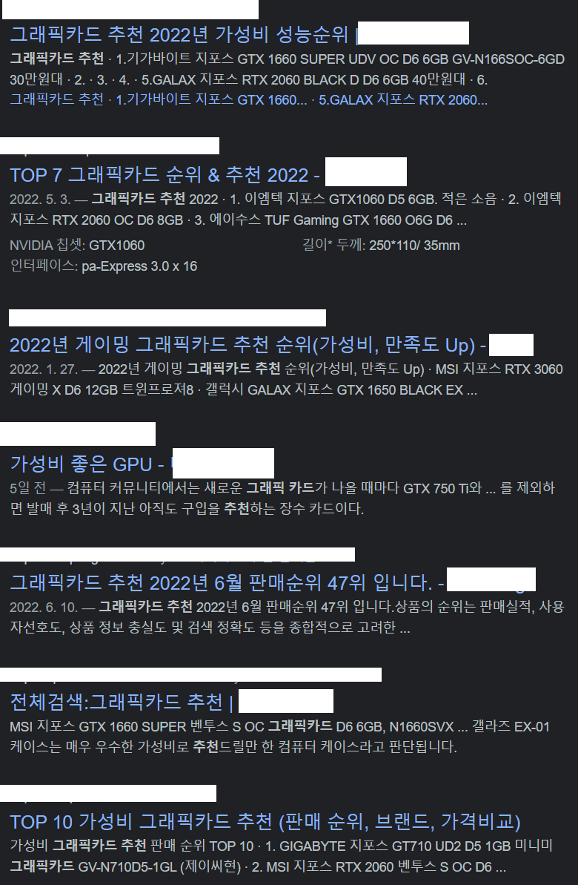
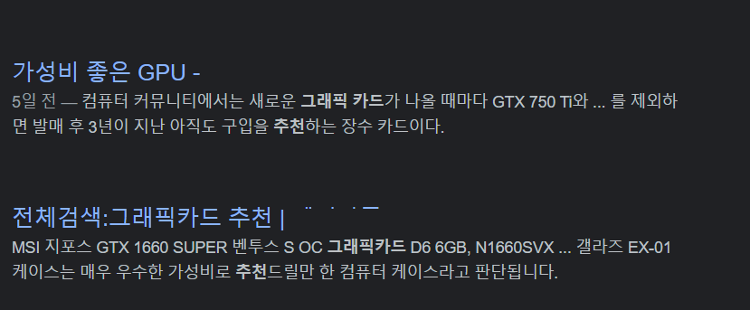

[](https://hits.seeyoufarm.com)

# no-coupang-partners

쿠팡 파트너스 링크만 있는 사이트를 숨깁니다.

## 기능

1. 검색 결과에 보이는 쿠팡 파트너스 링크만 있는 사이트를 숨깁니다. 지원 대상: [Google](https://google.com), [DuckDuckGo](https://duckduckgo.com/)

2. 쿠팡 파트너스 추적 링크를 제거합니다.

## 적용 사진

<details>
<summary>눌러서 보기</summary>

사용 전:



사용 후:


</details>

## 설치

**no-coupang-partners** ([AdGuard](https://adguard.com), [uBlock Origin](https://github.com/gorhill/uBlock))

```
https://raw.githubusercontent.com/green1052/no-coupang-partners/master/filter.txt
```

**no-coupang-partners** (Legacy, DNS)

**!주의! 해당 필터는 사이트 접속만을 차단할 수 있습니다.**

!#include 문법 미지원 광고 차단기와 DNS 필터링만을 위한 필터

```
https://raw.githubusercontent.com/green1052/no-coupang-partners/master/hosts.txt
```

# Special Thanks

[List-KR](https://github.com/List-KR) - [List-KR](https://github.com/List-KR/List-KR)

[RyuaNerin](https://github.com/RyuaNerin) - [only-stackoverflow](https://github.com/RyuaNerin/only-stackoverflow)
